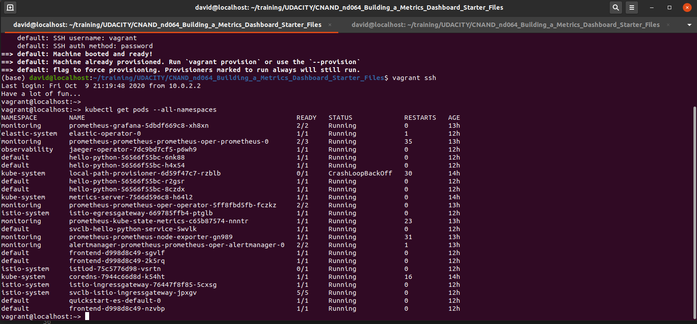
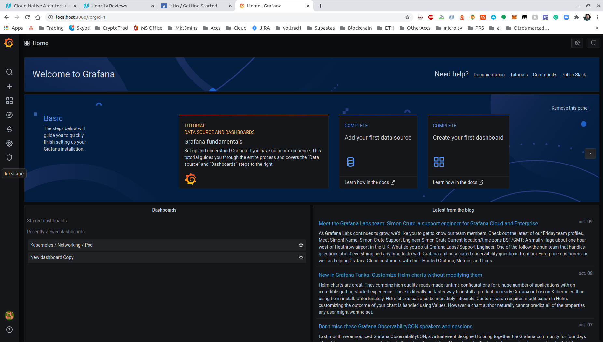
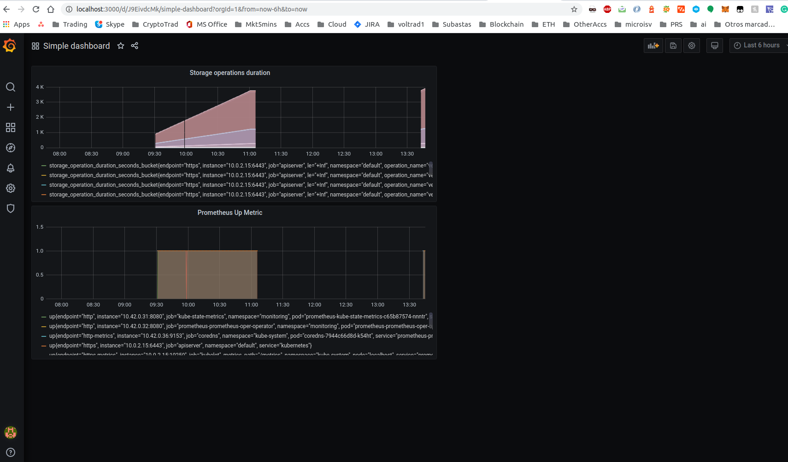

**Note:** For the screenshots, you can store all of your answer images in the `answer-img` directory.

## Verify the monitoring installation

*TODO:* run `kubectl` command to show the running pods and services for the three components. Copy and paste the output or take a screenshot of the output and include it here to verify the installation

## Setup the Jaeger and Prometheus source
*TODO:* Expose Grafana to the internet and then setup Prometheus as a data source. Provide a screenshot of the home page after logging into Grafana.

## Create a Basic Dashboard
*TODO:* Create a dashboard in Grafana that shows Prometheus as a source. Take a screenshot and include it here.

## Describe SLO/SLI
*TODO:* Describe, in your own words, what the SLIs are, based on an SLO of *monthly uptime* and *request response time*. 

Service level indicators are metrics used to measure the performance of a system. Referencing certain established goals or Service level objectives (SLOs) to be achieved by a given system, the SLIs measure the degree or the percentage to which those goals should be achieved.
So for a SLO of monthly uptime of 99,9% (which refence the percentage of minutes in a month where the system is up) the SLI is the actual percentage of minutes of uptime in a given month.  
Similarly for average request/response time as an SLO, the average request/response time in miliseconds can be defined for a given application in terms of 500 ms as and objective and the SLI would be the actual average value observed in a given period of observation.

## Creating SLIs and KPIs
*TODO:* We want to ensure that our application doesn't show any downtime, 500 errors, or slow speeds. Describe in detail 6 KPIs to measure these SLIs.

monitoring is about events, these events can be almost anything

how much time was spent handling requests, and how many requests are currently in progress

Prometheus Metric How may 500 errors:
promhttp_metric_handler_requests_total{code="500"}

rate(promhttp_metric_handler_requests_total{code="500"}[60m])

500 errors
----------

error rate is a good indicator for the health of a system. We define this metric the application error rate as the number of requests that result in an error per time unit

The application error percentage is the number of requests that result in an error compared to the total number of requests.

rate(promhttp_metric_handler_requests_total{code="500"}[5m])/rate(promhttp_metric_handler_requests_total[5m])

Downtime
--------

sum(up == 1)/ sum(up)

Slow speed
-----------

## Create a Dashboard to measure our SLIs
*TODO:* Create a dashboard to measure the uptime of the frontend and backend service as well as the Redis deployment. We will also want to measure to measure 40x and 50x errors. Create a dashboard that show these values over a 24 hour period and take a screenshot.

Usar los ejemplos de https://grafana.com/grafana/dashboards que ya se han importando en la imagen y/o otros

## Tracing our Flask App
*TODO:*  We will create a Jaeger span to measure the processes on the backend. Once you fill in the span, provide a screenshot of it here. 

## Jaeger in Dashboards
*TODO:* Now that the trace is running, let's add the metric to our current Grafana dashboard. Once this is completed, provide a screenshot of it here.

## Report Error
*TODO:* Using the template below, write a trouble ticket for the developers, to explain the errors that you are seeing (400, 500, latency) and to let them know the file that is causing the issue.

TROUBLE TICKET

Name: 

Date: 

Subject: 

Affected Area:

Severity:

Description: 

## Creating SLIs and SLOs
*TODO:* We want to create an SLO guaranteeing that our application has a 99.95% uptime per month. Name three SLIs that you would use to measure the success of this SLO.

## Building KPIs for our plan
*TODO*: Now that we have our SLIs and SLOs, create KPIs to accurately measure these metrics. We will make a dashboard for this, but first write them down here.

## Final Dashboard
*TODO*: Create a Dashboard containing graphs that capture all the metrics of your KPIs and adequately representing your SLIs and SLOs. Include a screenshot of the dashboard here, and write a text description of what graphs are represented in the dashboard.  

